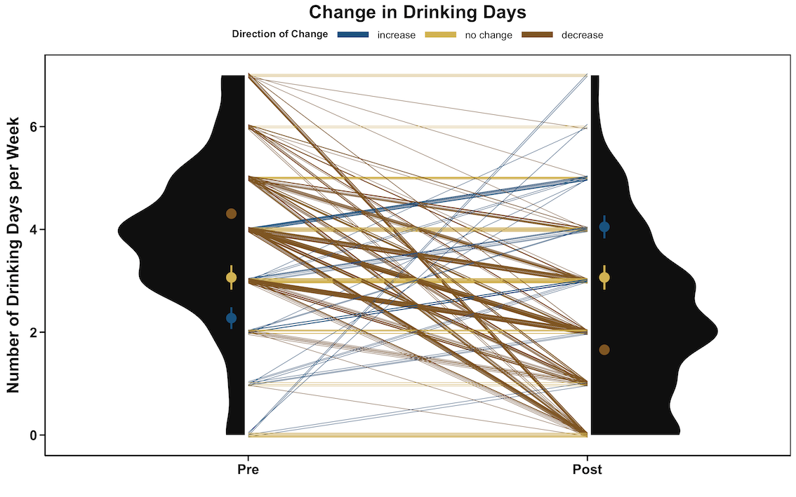
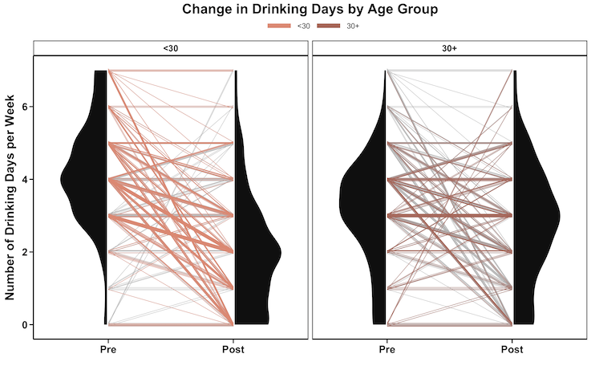
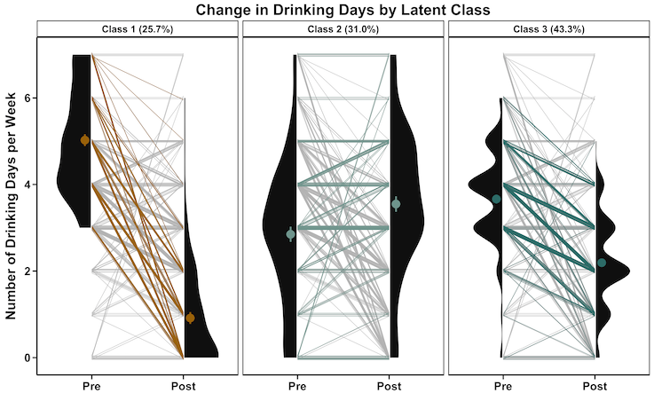

```{r setup, echo=FALSE, message=FALSE, results='hide'}
knitr::opts_chunk$set(fig.width = 15, fig.height = 9, fig.align = "center")
```

Corset plots are a visualization technique used to visualize repeat measures at 2 time points (such as pre- and post- data). Specifically, corset plots visualize the distribution of measurements at each time point, as well as the trajectories of individual change. This method of visualization is ideal for showing the heterogeneity of data and differences by sub-groups.

The '**ggcorset**' package relies on '[ggplot2](https://ggplot2.tidyverse.org)' to make its visualizations, allowing for easy customization and integration with other 'ggplot2' objects. This vignette will introduce uses of this visualization technique, as well as how to make customizations using 'ggplot2'. For specific functionality, the GitHub README^1^ or the CRAN Package Manual^2^ should be consulted.

## Data Structure

The '**ggcorset**' package provides two functions -- `gg_corset()` and `gg_corset_elongated()` -- which produce visualizations for wide and long data formats, respectively. The visualizations produced by these functions are identical.

The **c_var** variable is a user-defined variable that make the individual-level changes interpretable, and should be chosen strategically. This variable can be a discrete value reflecting change types or sub-groups. It can also be a continuous value to highlight levels of change. As such, various `c_var` strategies are outlined in this vignette.

## Anatomy of a Corset Plot

A corset plot consists of: 

i) two half violins to highlight the overall distribution at each time point; 

ii) individual trajectories of change between each time point; and optionally 

iii) 'eyelets' which show the standard error mean (SEM) of a user-defined group


<center>

{width="650"}
</center>

The plot above was created using the sample ggcorset data "drinkdays", and by creating a variable which captures the direction of change across the two timepoints. The `theme_ggcorset()` was used to polish the visualization alongside a few ggplot2 commands to customize the titles and axes.

```{r, fig.show='hide'}

library(ggcorset)
library(ggplot2)

# LOAD "drinkdays" data from the ggcorset package
data("drinkdays")

# Magnitude of change: Subtract T1 from T2
drinkdays$change <- drinkdays$time2-drinkdays$time1

# Direction of Change
drinkdays$direction <- ifelse(drinkdays$change<0,"Decrease",
                              ifelse(drinkdays$change>0,"Increase","No Change"))
drinkdays$direction <- factor(drinkdays$direction, 
                              levels = c("Increase","No Change","Decrease"))

# CORSET PLOT: Basic plot + theme_ggcorset()
plot <- gg_corset(drinkdays, y_var1 = "time1", y_var2 = "time2", 
                  c_var = "direction", group = "id", eyelets = T) + 
        theme_ggcorset()

# ADDITIONAL ggplot2 commands
plot + 
  # Changes legend title, and selects a colour-palette
  scale_colour_manual("Direction of Change",
                    values = MetBrewer::met.brewer("Ingres",3)) +
  # Changes the plot title
  ggtitle("Change in Drinking Days") + 
  # Changes the y-axis title
  ylab("Number of Drinking Days per Week") + 
  # Changes the x-axis title (removes in favour of the 2 time point labels below)
  xlab("") +
  # Changes the labels of the 2 time points (on the x-axis)
  scale_x_discrete(labels = c("Pre","Post")) +
  # Makes the legend lines thicker
  guides(colour = guide_legend(override.aes = list(size = 3)))

```

## Faceted Corset Plots

Corset plots can also be faceted using the `faceted = T` argument, whereby all individual trajectories are used in the background of the plot. Eyelets can be used in conjunction with the faceted corset plots, if desired.

```{r,out.width=650}

gg_corset(drinkdays, y_var1 = "time1", y_var2 = "time2",
          c_var = "direction", group = "id", faceted = T) + 
  theme_ggcorset() +  
  scale_colour_manual("Direction of Change",
                      values = MetBrewer::met.brewer("Troy",3))  +
  ggtitle("Change in Drinking Days") + 
  ylab("Number of Drinking Days per Week") + xlab("") +
  scale_x_discrete(labels = c("Pre","Post")) +
  guides(colour = guide_legend(override.aes = list(size = 3)))

```

## Continuous Change Values

Corset plots also lend themselves to showing continuous values of change, which can act as a heatmap of sorts, to visualize extreme values as well as overall trends.

``` {r, out.width=650}

gg_corset(drinkdays, y_var1 = "time1", y_var2 = "time2", 
          c_var = "change", group = "id", line_size = 0.5) + 
  theme_ggcorset() +
  viridis::scale_colour_viridis(
    option = "cividis", direction = -1,
    breaks = c(-7,0,7),  # can set the legend limits here (min and max)
    name = "") +         # can rename the legend title here or omit
  ggtitle("Change in Drinking Days") +
  ylab("Number of Drinking Days per Week") + xlab("") +
  scale_x_discrete(labels = c("Pre","Post"))

```

## Other Categorizations

As noted previously, corset plots are a great way to visualize heterogeneity amongst data. Thus, the magnitude of homogeneity across groups can be inspected by using a `c_var` variable for observed or latent sub-groups. Some examples using simulated^3^ data from the "drinkdays" data set are age categories and latent classes (derived from a latent class analysis).

In the first example, individuals were categorized by young adults (29 years of age and younger) and adults (30 years of age and older). Young adults often partake in heavy episodic drinking, a phenomenon whereby individuals 'age out' of risky drinking behaviours over time. As seen in the faceted corset plots, those under 30 years of age are seeing decreases in their number of drinking days per week, compared to those 30 years of age and older who are more stable in their drinking days over time. 

<center>

{width="525"}

</center>

By plotting the data using corset plots, we are able to see the heterogeneity still present by age categories, notably how some <30 adults are maintaining their drinking levels and those 30+ have increased in some instances.

In the second example, individuals are categorized into three latent classes which were obtained by numerous drinking and mental health outcomes. The corset plots are visualizing distal outcomes of drinking days by these latent classes. Class 1 shows a notable decrease in drinking days; Class 2 shows an overall increase, with many individuals showing no change in their alcohol use; and Class 3 shows a decrease, but is less drastic than Class 1, whereby change is largely by a magnitude of 1 day and no individuals consumed alcohol 7-days a week.

<center>

{width="525"}
</center>

By plotting the distal outcome of drinking days by a latent class, we are able to see how well these latent classes were able to predict drinking outcomes - in this instance, drinking days per week.

***

^1^ https://github.com/kbelisar/ggcorset/blob/main/README.md

^2^ https://cran.r-project.org/web/packages/ggcorset/ggcorset.pdf

^3^ The "drinkdays" data from the 'ggcorset' package are simulated data. Age and latent classes (not available in the package) are also simulated categories to demonstrate the possible uses of `c_var`, and are based on trends observed in the research of substance use.
